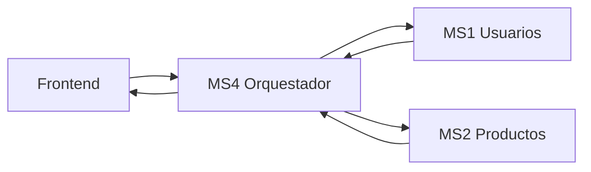
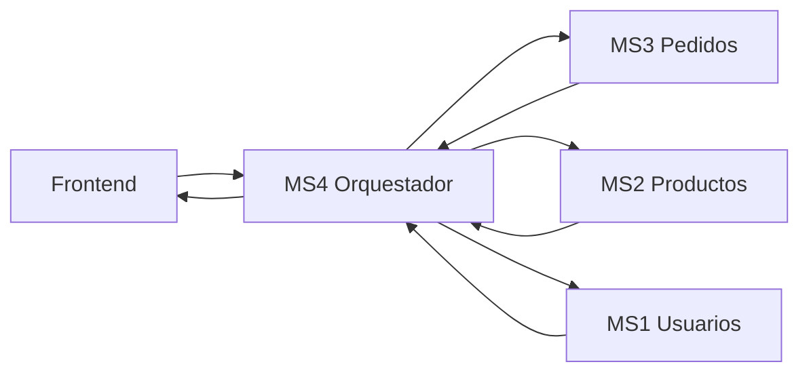

# 🚀 CloudApp Frontend - Web de Delivery

Frontend para el proyecto de Cloud Computing que implementa una interfaz web moderna para gestionar operaciones de delivery mediante orquestación de microservicios.

## 📋 Descripción del Proyecto

Esta aplicación frontend conecta con una arquitectura de microservicios desplegada en AWS que gestiona usuarios, productos, pedidos y analytics de un sistema de delivery. La aplicación está construida con **React**, **TypeScript** y **Tailwind CSS**.

## 🏗️ Arquitectura del Backend

El sistema backend está compuesto por 5 microservicios desplegados mediante Docker Compose y AWS CloudFormation:

### Microservicios (Puertos 8001-8005)

| Puerto | Servicio | Tecnología | Descripción |
|--------|----------|------------|-------------|
| 8001 | **MS1-Usuarios** | Python + MySQL | Gestión de usuarios y direcciones |
| 8002 | **MS2-Productos** | Java + PostgreSQL | Catálogo de productos y categorías |
| 8003 | **MS3-Pedidos** | TypeScript + MongoDB | Órdenes e historial de pedidos |
| 8004 | **MS4-Orquestador** | Delivery Orchestrator | Orquestación y lógica de negocio |
| 8005 | **MS5-Analytics** | Data Science | Métricas y análisis de datos |

### Bases de Datos
- **MySQL** (Puerto 3307): Usuarios y direcciones
- **PostgreSQL** (Puerto 5555): Productos y categorías  
- **MongoDB** (Puerto 27017): Pedidos e historial

## 🎯 Funcionalidades Principales

### 1. 👥 Gestión de Usuarios
- Registro y autenticación
- Perfil de usuario
- Gestión de direcciones

### 2. 📦 Catálogo de Productos
- Exploración de productos
- Filtros por categoría
- Gestión de inventario

### 3. 🛒 Gestión de Pedidos
- Creación de órdenes
- Seguimiento de estados
- Historial de pedidos


### 5. 📊 Analytics
- Estadísticas de usuarios
- Ranking de categorías
- Métricas de ventas

## 🛠️ Tecnologías Utilizadas

### Frontend
- **React 18** - Framework principal
- **TypeScript** - Tipado estático
- **Vite** - Build tool y dev server
- **React Router** - Enrutamiento
- **Tailwind CSS** - Estilos y componentes
- **ESLint** - Linting y calidad de código

### Integraciones
- **REST APIs** - Comunicación con microservicios
- **Context API** - Gestión de estado global
- **Custom Hooks** - Lógica reutilizable

## 📁 Estructura del Proyecto

```
src/
├── components/           # Componentes reutilizables
│   ├── auth/            # Autenticación
│   ├── common/          # Componentes comunes
│   ├── delivery/        # 🆕 Orquestador Delivery
│   ├── pedidos/         # Gestión de pedidos
│   └── productos/       # Catálogo de productos
├── contexts/            # Contextos de React
├── hooks/               # Hooks personalizados
├── interfaces/          # Tipos de TypeScript
├── pages/               # Páginas principales
├── router/              # Configuración de rutas
├── services/            # Servicios API
├── styles/              # Estilos globales
└── utils/               # Utilidades
```

## 🚀 Instalación y Configuración

### Prerrequisitos
- Node.js 18+
- npm o yarn

### Pasos de instalación

1. **Clonar el repositorio**
```bash
git clone https://github.com/JosephAnderson234/cloud-frontend.git
cd cloud-frontend
```

2. **Instalar dependencias**
```bash
npm install
```

//settear variables de entorno  (link de aws amplify en formato VITE_API_URL)

4. **Ejecutar en desarrollo**
```bash
npm run dev
```

5. **Construir para producción**
```bash
npm run build
```


### Características de UX
- **Navegación por tabs** entre funcionalidades
- **Validación en tiempo real** de formularios
- **Estados de carga** y manejo de errores
- **Notificaciones** de éxito/error
- **Diseño responsive** con Tailwind CSS
- **Indicadores visuales** de cambios de precio
- **Comparación** de totales históricos vs actuales

## 📚 Endpoints Utilizados

### MS1 - Usuarios (Puerto 8001)
```
GET /usuarios/{id_usuario}     # Validación de usuario
GET /direcciones/{id_usuario}  # Direcciones del usuario
```

### MS2 - Productos (Puerto 8002)
```
GET /productos/{id_producto}   # Precios actuales
GET /categorias/{id_categoria} # Información de categorías
```

### MS3 - Pedidos (Puerto 8003)
```
GET /pedidos/{id_pedido}       # Datos históricos del pedido
```

### MS4 - Orquestador (Puerto 8004)
```
POST /orq/cart/price-quote                    # Cotización
GET /orq/orders/{id}/details?id_usuario=X     # Detalles enriquecidos
```

### MS5 - Analytics (Puerto 8005)
```
GET /health                    # Estado del servicio
GET /ranking_categorias        # Estadísticas
```

## 🔄 Flujo de Orquestación

### Cotización de Carrito


### Detalles de Pedido


## 🎨 Rutas de la Aplicación

| Ruta | Componente | Descripción |
|------|------------|-------------|
| `/` | Home | Dashboard principal |
| `/auth/login` | Login | Inicio de sesión |
| `/auth/register` | Register | Registro de usuario |
| `/products` | Productos | Catálogo de productos |
| `/orders` | Pedidos | Gestión de pedidos |
| `/delivery` | **Delivery** | 🆕 Orquestador Delivery |

## 🤝 Contribuir

1. Fork el proyecto
2. Crear rama de feature (`git checkout -b feature/nueva-funcionalidad`)
3. Commit los cambios (`git commit -am 'Agregar nueva funcionalidad'`)
4. Push a la rama (`git push origin feature/nueva-funcionalidad`)
5. Abrir Pull Request

## 📄 Licencia

Este proyecto está bajo la licencia MIT - ver el archivo [LICENSE](LICENSE) para detalles.

## 👥 Autores

- **Frontend**: [JosephAnderson234](https://github.com/JosephAnderson234)
- **MS1-Usuarios**: [PauloMiraBarr](https://github.com/PauloMiraBarr/ms1-usuarios)
- **MS2-Productos**: [EV081](https://github.com/EV081/ms2_products.git)
- **MS3-Pedidos**: [jcarlos-t](https://github.com/jcarlos-t/Pedidos-MS3.git)
- **MS4-Gestor Delivery**: [J-D-Rosales](https://github.com/J-D-Rosales/Microservicios_orquestador.git)
- **MS5-Analytics**: [EV081](https://github.com/EV081/ms5.git)
- **Base de Datos**: [jcarlos-t](https://github.com/jcarlos-t/PCloud-BD.git)

---

**CloudApp Frontend** - Curso de Cloud Computing 2025
