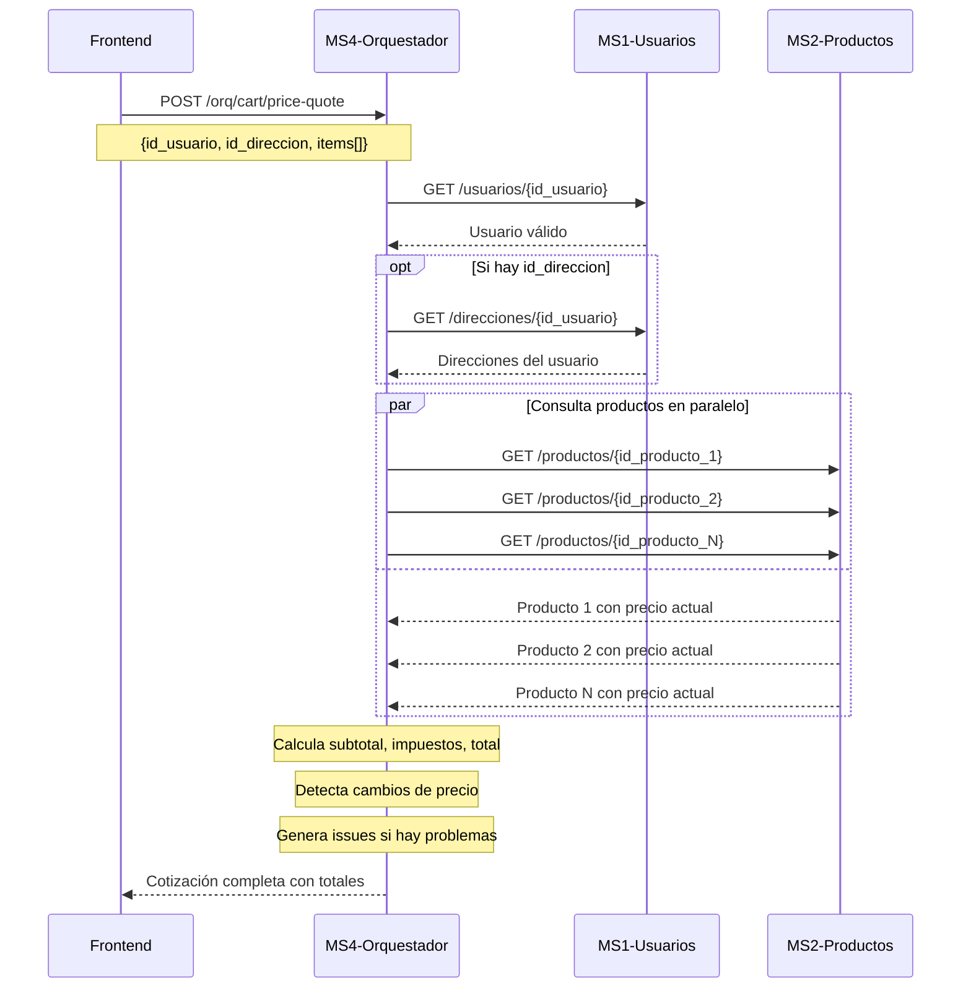
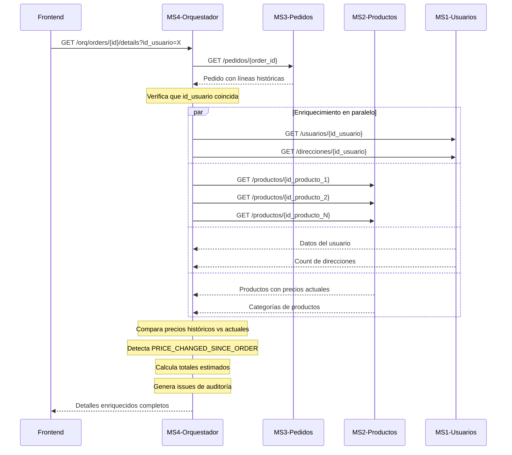

# 🏗️ Documentación Técnica - Arquitectura y Flujos

## 📐 Arquitectura General del Sistema

### Diagrama de Microservicios
```
┌─────────────────┐    ┌─────────────────┐    ┌─────────────────┐
│   Frontend      │    │   Load Balancer │    │   Backend       │
│   React App     │◄──►│   AWS ALB       │◄──►│   Docker Swarm  │
│   Port: 3000    │    │   Ports:8001-05 │    │   5 Services    │
└─────────────────┘    └─────────────────┘    └─────────────────┘
                                                       │
                       ┌───────────────────────────────┼───────────────────────────────┐
                       │                               │                               │
                       ▼                               ▼                               ▼
           ┌─────────────────┐              ┌─────────────────┐              ┌─────────────────┐
           │   Database      │              │   Database      │              │   Database      │
           │   MySQL:3307    │              │ PostgreSQL:5555 │              │ MongoDB:27017   │
           │   Users         │              │   Products      │              │   Orders        │
           └─────────────────┘              └─────────────────┘              └─────────────────┘
```

### Mapeo de Puertos y Servicios
| Puerto | Servicio | Base de Datos | Repositorio |
|--------|----------|---------------|-------------|
| 8001 | MS1-Usuarios | MySQL | [ms1-usuarios](https://github.com/PauloMiraBarr/ms1-usuarios) |
| 8002 | MS2-Productos | PostgreSQL | [ms2_products](https://github.com/EV081/ms2_products.git) |
| 8003 | MS3-Pedidos | MongoDB | [Pedidos-MS3](https://github.com/jcarlos-t/Pedidos-MS3.git) |
| 8004 | MS4-Orquestador | N/A | [Microservicios_orquestador](https://github.com/J-D-Rosales/Microservicios_orquestador.git) |
| 8005 | MS5-Analytics | Multi-DB | [ms5](https://github.com/EV081/ms5.git) |

## 🔄 Flujos de Orquestación

### 1. Cotización de Carrito



### 2. Detalles Enriquecidos de Pedido



## 🌐 Arquitectura de Red

### AWS CloudFormation - Seguridad
```
Internet Gateway
        │
        ▼
┌─────────────────┐
│  Application    │  Ports: 8001-8005
│  Load Balancer  │  Health Checks: HTTP
│  (Public)       │  Target Groups: 5
└─────────────────┘
        │
        ▼
┌─────────────────┐    ┌─────────────────┐
│   EC2Prod1      │    │   EC2Prod2      │
│   Security:     │    │   Security:     │
│   GSProdPC      │    │   GSProdPC      │
│   Ports:8001-05 │    │   Ports:8001-05 │
└─────────────────┘    └─────────────────┘
        │                       │
        └───────────────────────┘
                    │
                    ▼
            ┌─────────────────┐
            │   EC2Database   │
            │   Security:     │
            │   GSDatabase    │
            │   MySQL: 3307   │
            │   PostgreSQL:555│
            │   MongoDB: 27017│
            └─────────────────┘
```

### Security Groups
```yaml
GSProdPC:
  Ingress:
    - Port: 22 (SSH)
    - Ports: 8001-8005 (HTTP APIs)
  Egress: All

GSDatabase:
  Ingress:
    - Port: 22 (SSH)
    - Port: 3307 (MySQL) from GSProdPC
    - Port: 5555 (PostgreSQL) from GSProdPC  
    - Port: 27017 (MongoDB) from GSProdPC
    - Port: 8080 (Management)
  Egress: All
```

## 📊 Estructura de Datos

### MS1 - Usuarios (MySQL)
```sql
-- Tabla: usuarios
CREATE TABLE usuarios (
    id_usuario INT PRIMARY KEY AUTO_INCREMENT,
    nombre VARCHAR(100),
    correo VARCHAR(100) UNIQUE,
    contraseña VARCHAR(255),
    telefono VARCHAR(15)
);

-- Tabla: direcciones  
CREATE TABLE direcciones (
    id_direccion INT PRIMARY KEY AUTO_INCREMENT,
    id_usuario INT,
    direccion VARCHAR(255),
    ciudad VARCHAR(100),
    codigo_postal VARCHAR(10),
    FOREIGN KEY (id_usuario) REFERENCES usuarios(id_usuario) ON DELETE CASCADE
);
```

### MS2 - Productos (PostgreSQL)
```sql
-- Tabla: categorias
CREATE TABLE categorias (
    id_categoria SERIAL PRIMARY KEY,
    nombre_categoria VARCHAR(100),
    descripcion_categoria TEXT
);

-- Tabla: productos
CREATE TABLE productos (
    id_producto SERIAL PRIMARY KEY,
    nombre VARCHAR(100),
    descripcion TEXT,
    precio DECIMAL(10,2),
    categoria_id INTEGER REFERENCES categorias(id_categoria)
);
```

### MS3 - Pedidos (MongoDB)
```javascript
// Colección: pedidos
{
  _id: ObjectId,
  id_usuario: Number,
  fecha_pedido: Date,
  estado: String, // "pendiente" | "entregado" | "cancelado"
  total: Number,
  productos: [
    {
      id_producto: Number,
      cantidad: Number,
      precio_unitario: Number
    }
  ]
}

// Colección: historialPedido
{
  _id: ObjectId,
  id_pedido: ObjectId,
  id_usuario: Number,
  fecha_evento: Date,
  estado: String,
  comentarios: String
}
```

## 🔧 Configuración de Desarrollo

### Docker Compose Local
```yaml
version: '3.8'
services:
  ms1-usuarios:
    image: ms1-usuarios:latest
    ports: ["8001:8000"]
    environment:
      DB_HOST: ${DB_HOST}
    networks: [backend]
    
  ms2-productos:
    image: ms2-productos:latest  
    ports: ["8002:8080"]
    networks: [backend]
    
  ms3-pedidos:
    image: ms3-pedidos:latest
    ports: ["8003:3000"]  
    networks: [backend]
    
  ms4-orquestador:
    image: ms4-orquestador:latest
    ports: ["8004:8000"]
    networks: [backend]
    
  ms5-analytics:
    image: ms5-analytics:latest
    ports: ["8005:8000"]
    networks: [backend]

networks:
  backend:
    driver: bridge
```

### Variables de Entorno para Microservicios
```bash
# Bases de datos
DB_HOST=host.docker.internal
MYSQL_URL=mysql://user:pass@${DB_HOST}:3307/delivery_users
POSTGRES_URL=postgresql://user:pass@${DB_HOST}:5555/delivery_products  
MONGO_URL=mongodb://${DB_HOST}:27017/delivery_orders

# CORS y configuración
GLOBAL_CORS=http://localhost:3000
TAX_RATE=0.18

# URLs internas para orquestación
MS1_URL=http://ms1-usuarios:8000
MS2_URL=http://ms2-productos:8080  
MS3_URL=http://ms3-pedidos:3000
```

## 🚀 Despliegue en Producción

### AWS CloudFormation Stack
```yaml
Parameters:
  AMIId: ami-xxxxxxxxx
  InstanceType: t3.medium
  VolumeSize: 20
  KeyName: your-key-pair
  VpcId: vpc-xxxxxxxxx
  SubnetAId: subnet-xxxxxxxxx
  SubnetBId: subnet-xxxxxxxxx
  HealthCheckPath: /health

Resources:
  # Application Load Balancer
  # Target Groups (8001-8005)  
  # EC2 Instances
  # Security Groups
  # Auto Scaling (opcional)
```

### Monitoreo y Logs
- **CloudWatch**: Métricas de EC2 y ALB
- **Application Logs**: Agregados por servicio
- **Health Checks**: HTTP en /health endpoints
- **Alertas**: CPU, memoria, latencia

## 🔍 Debugging y Troubleshooting

### Endpoints de Diagnóstico
```bash
# Health checks de cada servicio
curl http://localhost:8001/health  # MS1
curl http://localhost:8002/health  # MS2  
curl http://localhost:8003/health  # MS3
curl http://localhost:8004/health  # MS4
curl http://localhost:8005/health  # MS5

# Debug específico del orquestador
curl http://localhost:8004/orq/_debug/addresses/1
```

### Logs de Orquestación
El MS4-Orquestador logea:
- Llamadas a microservicios upstream
- Tiempos de respuesta
- Errores de validación
- Issues detectados

### Métricas Clave
- **Latencia P95**: < 2 segundos para cotizaciones
- **Disponibilidad**: > 99.5% por servicio
- **Tasa de error**: < 1% en orquestación
- **Throughput**: Requests por segundo

---

Esta documentación técnica proporciona una visión completa de la arquitectura, facilitando el desarrollo, despliegue y mantenimiento del sistema.